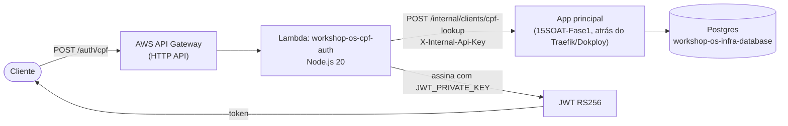

# workshop-os-lambda-auth

Function Serverless (AWS Lambda) da Fase 3 do Workshop OS — valida o CPF do
cliente, consulta sua existência/status na base de dados da aplicação
principal (via um endpoint interno, nunca acessando o Postgres direto — ver
[RFC-003](https://github.com/CandidoRPNeto/15SOAT-Fase1/blob/master/docs/architecture/rfcs/rfc-003-cpf-auth-strategy.md)),
e emite um JWT RS256 para consumo das APIs protegidas atrás do Traefik do
Dokploy.

Parte do split em 4 repositórios da Fase 3 do projeto
[15SOAT-Fase1](https://github.com/CandidoRPNeto/15SOAT-Fase1) — requisito
completo em [`evolucao_fase3`](https://github.com/CandidoRPNeto/15SOAT-Fase1/blob/master/evolucao_fase3),
decisões arquiteturais em
[RFC-003](https://github.com/CandidoRPNeto/15SOAT-Fase1/blob/master/docs/architecture/rfcs/rfc-003-cpf-auth-strategy.md),
[ADR-007](https://github.com/CandidoRPNeto/15SOAT-Fase1/blob/master/docs/architecture/adrs/adr-007-aws-api-gateway.md)
(API Gateway) e
[ADR-008](https://github.com/CandidoRPNeto/15SOAT-Fase1/blob/master/docs/architecture/adrs/adr-008-jwt-validation-layer.md)
(onde o token é validado).

## Propósito

`POST /auth/cpf { "cpf": "..." }` →
1. Valida o dígito verificador do CPF (checksum, sem chamada externa —
   `src/cpf.ts`).
2. Consulta `POST {APP_BASE_URL}/internal/clients/cpf-lookup` na app
   principal (`src/clientLookup.ts`).
3. Se o cliente existe e está `active`, assina um JWT RS256
   (`src/jwt.ts`) e devolve `{ token, token_type, expires_in }`.
4. Caso contrário (não existe ou `blocked`), `403` — mesma resposta pros
   dois casos, não vaza qual aconteceu.

Diagrama de sequência completo:
[`sequence-auth.md`](https://github.com/CandidoRPNeto/15SOAT-Fase1/blob/master/docs/architecture/diagrams/sequence-auth.md)
no repo principal.

## Tecnologias

- Node.js 20 + TypeScript (`strict: true`, sem `any`)
- [`jsonwebtoken`](https://www.npmjs.com/package/jsonwebtoken) (RS256)
- `esbuild` (bundle único pro deploy)
- `node:test` + `node:assert` (sem framework de teste externo)
- Terraform (`hashicorp/aws` + `hashicorp/archive`) — `aws_lambda_function`
  + `aws_apigatewayv2_*` (HTTP API)

## Execução local

```bash
npm install
npm run typecheck
npm test          # 19 testes — CPF, assinatura/verificação JWT real
                   # (chave RSA gerada por teste), lookup HTTP (fetch mockado),
                   # handler fim-a-fim (403 not-found/blocked, 200 + JWT válido)
npm run build      # gera dist/handler.js (bundle usado pelo Terraform)
```

## Deploy

```bash
export AWS_ACCESS_KEY_ID=...
export AWS_SECRET_ACCESS_KEY=...
export TF_VAR_app_base_url="https://<domínio da app principal>"
export TF_VAR_internal_api_key="<mesmo valor de LAMBDA_INTERNAL_API_KEY na app>"
export TF_VAR_jwt_private_key="$(cat private_key.pem)"

npm run build
terraform init
terraform apply
```

A chave pública correspondente (`openssl rsa -in private_key.pem -pubout`)
vai na env `CLIENT_JWT_PUBLIC_KEY` da aplicação principal — nunca a
privada, que só existe aqui.

**Status**: `terraform validate` passa contra os providers reais
(`hashicorp/aws` 5.100.0, `hashicorp/archive` 2.8.0); `apply` real ainda
não foi rodado — requer conta AWS e credenciais do usuário, não
disponíveis nesta sessão de desenvolvimento.

`main`/`homolog` protegidas (PR obrigatório). CI (`.github/workflows/ci.yml`)
roda typecheck + testes + build em todo push/PR. Deploy
(`.github/workflows/deploy.yml`) roda `terraform apply` gated em 5 secrets
(`AWS_ACCESS_KEY_ID`, `AWS_SECRET_ACCESS_KEY`, `APP_BASE_URL`,
`LAMBDA_INTERNAL_API_KEY`, `JWT_PRIVATE_KEY`) — sem eles, o job termina sem
erro (mesmo padrão dos outros repos de infra). **Sem backend Terraform
remoto configurado** — mesma lacuna documentada em
[RFC-002](https://github.com/CandidoRPNeto/15SOAT-Fase1/blob/master/docs/architecture/rfcs/rfc-002-managed-database-strategy.md);
aqui um backend S3 seria natural (já é AWS), mas não provisionado nesta
sessão.

## Diagrama de arquitetura



## Swagger / Postman

Não aplicável — este serviço não expõe Swagger próprio (é um único
endpoint, não uma API REST completa). Ver a
[collection Postman](https://github.com/CandidoRPNeto/15SOAT-Fase1/blob/master/Tech_Challenge.postman_collection.json)
do repo principal para o fluxo de auth ponta a ponta.
